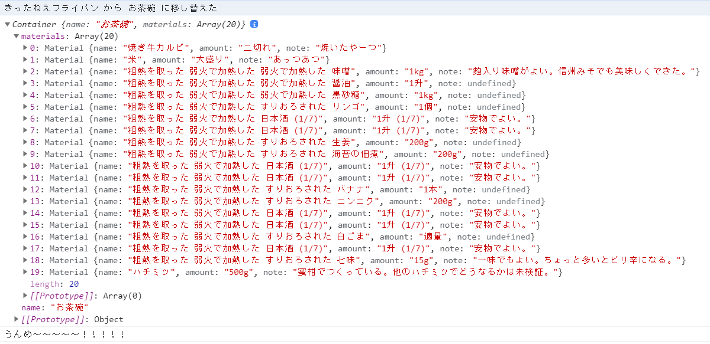

# はじめに

調理アルゴリズムの TypeScript 版です。  
適切な素材を用いて調理を行ってください。

# TypeScript

JavaScript や Node.js 等で利用できます。

# サンプルコード

`src/sample.ts`を参考、UMD コンパイルのため、ブラウザ、Node.js で利用できる。

## ブラウザ

`sample.html`に読み込みサンプルがあります。  
開いた後、console タブを確認してみてください。

## Node.js

```bash
yarn tsc
node ./dist/sample.js
```

## 出力


